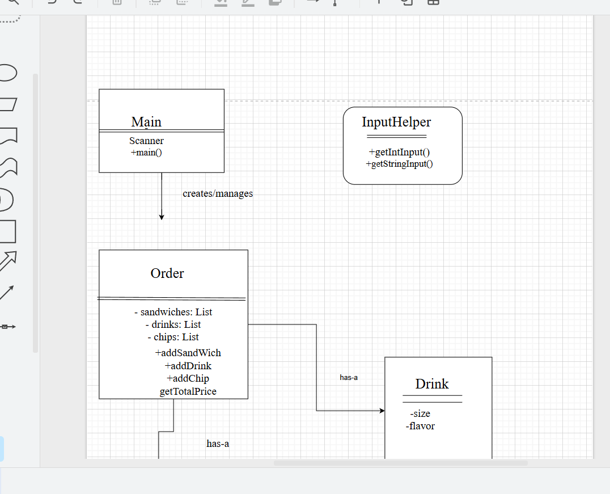
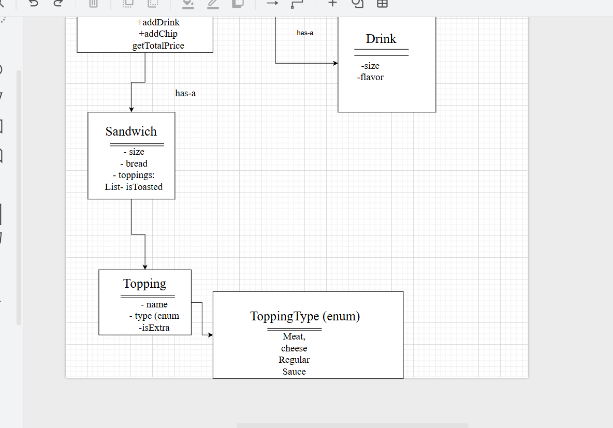

# Build-a-Bite

A Java CLI point-of-sale app for building custom sandwiches called Build-a-Bite.

## Features

-Custom sandwich builder (size, bread, toppings, sauces, toasted)
-Extra meat & cheese add-ons
-Drink & chip options
-Total cost calculator
-Receipt file saved to `receipts/` with timestamp
-Easy-to-use terminal menus

## Project Diagram

This diagram shows how the classes are structured and interact in the system:

